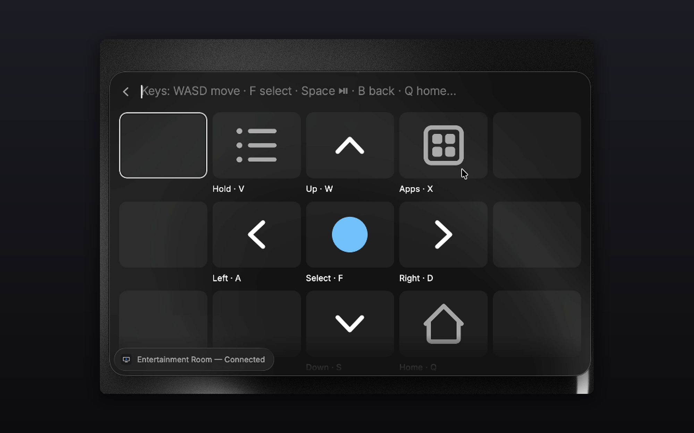
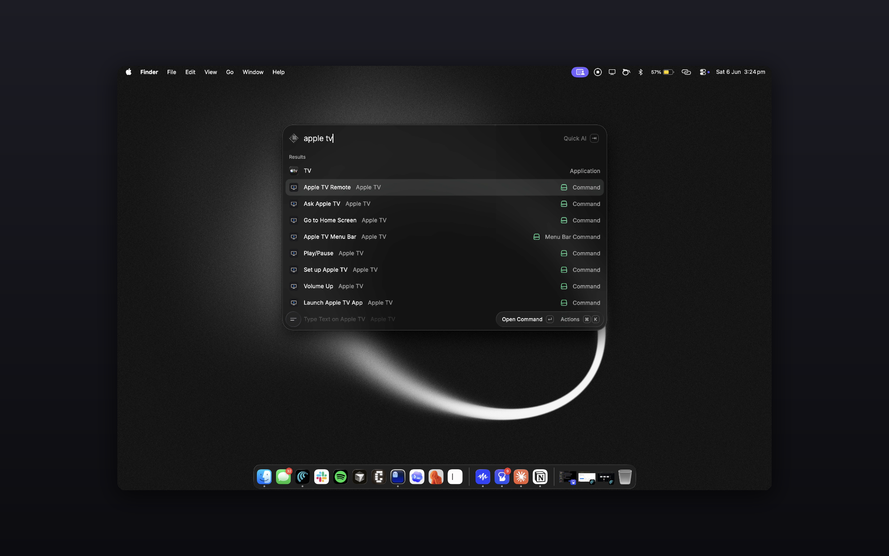
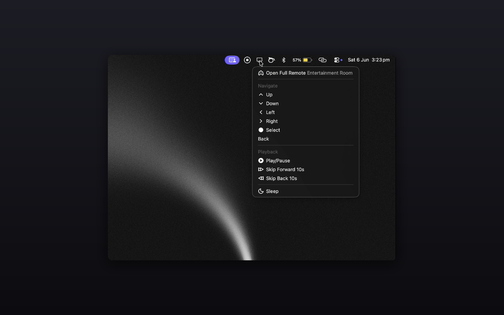

# Apple TV Remote for Raycast

Control your Apple TV from Raycast — no Python, no helper apps, no external installs. Pure TypeScript over Apple's Companion protocol.



## Features

- **Apple TV Remote** — a clickable on-screen remote with a persistent connection (every press is instant): d-pad, select, back, home, context menu (hold-select), app switcher, Control Center, playback, ±10s skip, and typing into TV search fields.
- **Launch Apple TV App** — a grid of every app installed on your Apple TV; open any of them, or save one as a hotkey-able Quicklink.
- **Ask Apple TV** — one-shot natural language: `pause` · `open netflix` · `play severance` · `type stranger things` · `sleep`.
- **Menu bar** — quick taps (play/pause, skip, navigate, open apps, sleep/wake) and one-click access to the full remote.
- **Per-key hotkey commands** — every remote function ships as its own command (most disabled by default): enable the ones you want and give them global hotkeys.
- **AI tools** — `@apple-tv-remote pause`, `@apple-tv-remote play Rick and Morty on Netflix` from Raycast AI (requires Pro).

| Every function, one search away | Remote in your menu bar |
|---|---|
|  |  |

## Setup

1. Run **Set up Apple TV**.
2. Pick your Apple TV from the list (or add it by IP + port if discovery is blocked on your network).
3. Type the 4-digit PIN that appears on your TV. Done.

> Pairing is interactive by design — the Apple TV generates a PIN on screen — which is why setup is a command rather than extension preferences.

## The remote

Open **Apple TV Remote** and either click the buttons or use the keyboard:

| Control | Bare key | With ⌥ |
|---|---|---|
| Navigate | `W` `A` `S` `D` (or `H` `J` `K` `L`) | `⌥↑` `⌥↓` `⌥←` `⌥→` |
| Select | `F` (or `G`) | `⌥↩` |
| Back | `B` | `⌥⌫` |
| Home | `Q` | — |
| Play/Pause | `Space` | `⌥P` |
| Skip ±10s | `,` / `.` | — |
| Previous / Next | `[` / `]` | — |
| Context menu (hold select) | `V` | — |
| App switcher | `X` | — |
| Control Center | `C` | — |
| Type text on TV | `T` | — |
| Screensaver | — | `⌥S` |

Bare keys work because the view intercepts typing — no modifiers needed. Volume commands exist as optional hotkey commands (`Volume Up`/`Volume Down`) but only work on setups where the Apple TV controls volume over HDMI-CEC; most TVs handle volume themselves.

## Playing a show

`play <title> [on <app>]` resolves the title to a **real** streaming deep link (via JustWatch — no guessed IDs) and opens it directly where the provider supports tvOS deep linking (Apple TV+, Disney+, Max, YouTube…). Netflix removed tvOS deep-link support in late 2025, so for Netflix (and unresolved titles) the extension launches the Apple TV's universal Search and types the title for you — you pick the result on screen. The **Search Automation** preference controls how far it goes.

## Preferences

- **Streaming Country** — two-letter code for where-to-watch lookups. Leave blank to auto-detect from your Mac's region.
- **Search Automation** — after typing a title into Apple TV Search: stop after typing, open the top result (default), or also press Play (may pick the wrong provider — the title page lists several).
- **Connection Timeout** — how long commands wait to reach the Apple TV.

## How it works

The extension speaks Apple's **Companion protocol** (the same one the iOS Remote app uses) directly from Raycast's Node runtime, via [`@bharper/atv-js`](https://github.com/bsharper/atvjs) — a pure-TypeScript port of [pyatv](https://pyatv.dev). Discovery is Bonjour, pairing is HAP SRP with the on-screen PIN, and the session is chacha20-poly1305 encrypted. App launching, app listing, sleep/wake, Control Center, hold-select, and ±10s skip are implemented in this extension on top of the library, ported from pyatv's reference implementation.

### Credential storage

Pairing produces machine-generated key material (not a user-entered secret), so it is kept in Raycast's encrypted [LocalStorage](https://developers.raycast.com/api-reference/storage) database, scoped to this extension. The extension never touches the macOS Keychain and sends nothing off your local network (the only internet call is the optional JustWatch title lookup).

## Development

```bash
npm install
npm run dev      # ray develop — hot-reloads into Raycast
npm run lint     # ray lint
npm run build    # ray build
```

| Module | Role |
|---|---|
| `src/lib/connection.ts` | Persistent session (remote view) + per-command `withConnection()` |
| `src/lib/companion-extras.ts` | Companion payloads ported from pyatv (launch app, app list, power, Control Center, hold, skip) |
| `src/lib/credentials.ts` / `devices.ts` | Pairing credentials + selected device in LocalStorage |
| `src/lib/justwatch.ts` | Title → real deep link resolution (keyless GraphQL, cached) |
| `src/lib/play-flow.ts` | Deep link → universal-search typing → app launch ladder |
| `src/lib/deep-links.ts` | Curated app/bundle map + installed-app cache |
| `src/lib/errors.ts` | Typed errors → actionable toasts |

## Credits

- [pyatv](https://pyatv.dev) by Pierre Ståhl (MIT) — the reference implementation and protocol documentation this extension is built on. The Companion payloads for app launching, app listing, power, and gestures are ported from pyatv.
- [`@bharper/atv-js`](https://github.com/bsharper/atvjs) by Brian Harper (MIT) — the TypeScript Companion-protocol port, itself derived from pyatv (© Pierre Ståhl).

See [NOTICE](NOTICE) for third-party license details.

## License

MIT
